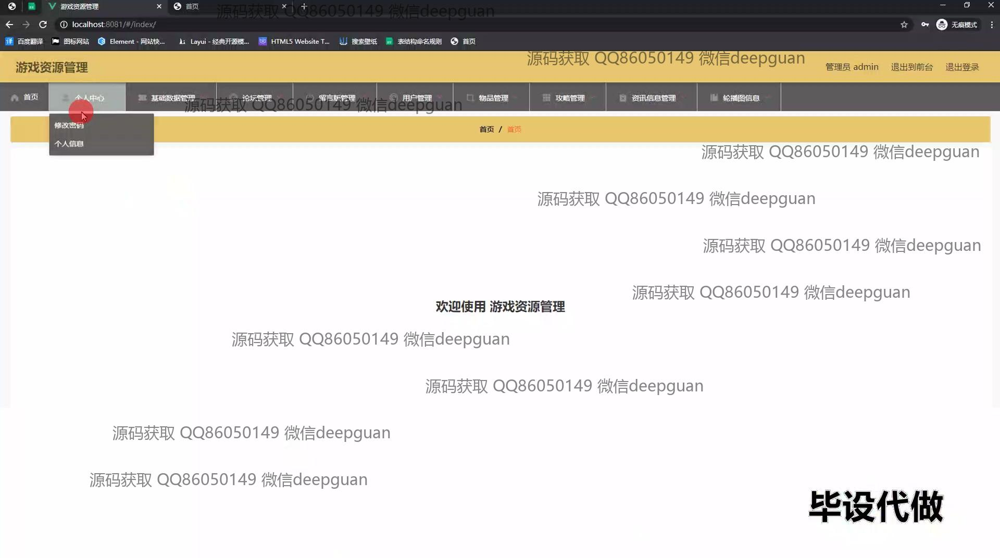
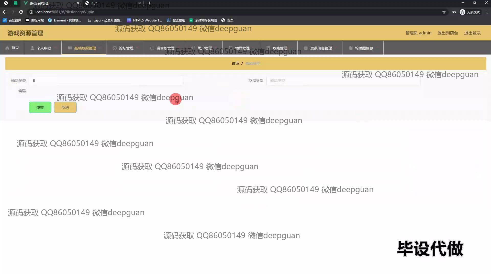

<h1 align="center">基于SSM的游戏资源管理系统+vue</h1>

## 简介
游戏资源管理系统：角色分为管理员、用户；功能模块包括论坛管理、物品管理、用户管理、攻略管理、资讯管理，支持资源上传、信息编辑与用户互动，以实现高效的游戏资源管理体验。    --计算机毕业设计源码；毕设源码；java毕业设计源码

## 联系方式

<h3 align="center">获取完整代码与数据库文件 + 微信：deepguan QQ: 86050149 QQ群: 783742310</h3>

<h3 align="center">可帮忙远程部署 包运行成功！提供远程部署、修改代码、设计文档指导、代码讲解等服务！</h3>

## 功能介绍（完整见运行截图）
管理员：主要功能包括管理用户、游戏资源、论坛帖子及系统设置。提供上传和管理游戏资源的功能，详尽的物品管理选项，支持物品的增删改查。维护论坛帖子及回复管理，修改和重置用户密码等。个人中心提供资料修改入口，显示登录信息与权限管理选项。

用户：可以注册和登录系统，浏览和搜索游戏资源，查看物品及其详细信息。参与论坛交流，通过留言板进行互动。个人中心让用户查看和更新个人信息、管理自己的游戏收藏及偏好设置。论坛设置允许帖子浏览及回复。

游客：可自由浏览公开的游戏资源信息，资讯和攻略。受限于未注册账户，游客无法参与互动功能如留言或发帖。鼓励游客注册成用户以访问更多功能。

开发者：利用系统进行游戏资源和信息的有效管理和发布。通过系统收集用户反馈和数据以便于进一步开发优化。可伸缩的设计让开发者增加新模块或功能，支持项目的迭代与升级。

## 运行截图

本代码来源于网络,仅供学习参考使用!

